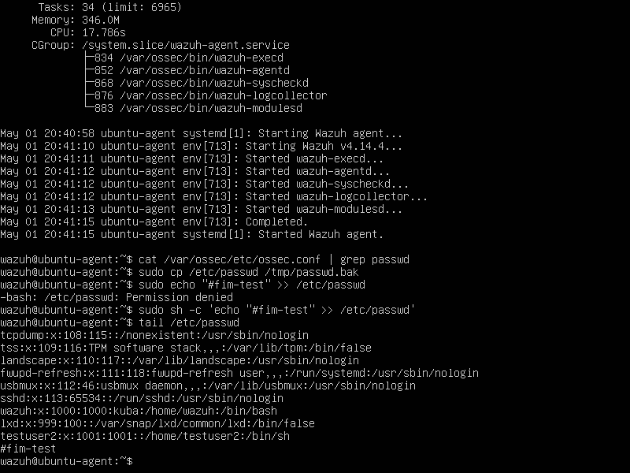
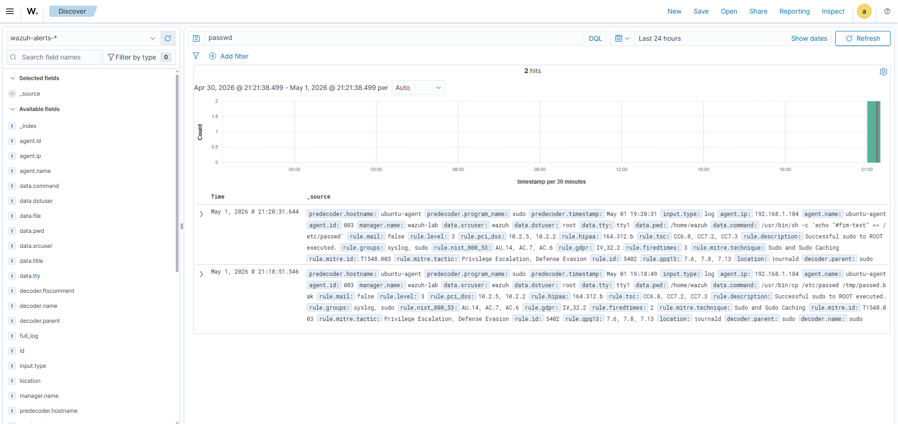

# 📁 Wazuh SIEM Lab – File Integrity Monitoring (FIM) Detection (Linux)

## 📌 Overview

This project demonstrates detection of unauthorized file modifications using File Integrity Monitoring (FIM) in a Wazuh SIEM environment.

The objective was to simulate tampering with a critical system file and verify that the change is detected and logged.

---

## 🏗️ Lab Environment

* SIEM: Wazuh Manager (Ubuntu Server)
* Target: Ubuntu Linux (Wazuh Agent)
* Scenario Type: Defense Evasion / Persistence
* Network: Isolated lab (VirtualBox)

---

## 🎯 Attack Scenario

A modification was made to a critical system file:

```bash
/etc/passwd
```

This file is responsible for storing user account information and is a high-value target for attackers.

---

## ⚡ Attack Execution

Backup created:

```bash
sudo cp /etc/passwd /tmp/passwd.bak
```

Modification performed:

```bash
echo "#fim-test" | sudo tee -a /etc/passwd
```

---

## 🔍 Evidence of Change

The modification was confirmed:

```bash
tail /etc/passwd
```

Output:

```text
#fim-test
```

---

## 🚨 Detection in Wazuh

Wazuh detected the modification via File Integrity Monitoring.

### Alert Details

* Event Type: File modified
* File Path: `/etc/passwd`
* Detection Method: FIM (File Integrity Monitoring)
* Agent: Linux endpoint

---

## 🧠 Analysis

The modification of `/etc/passwd` is a highly sensitive event.

Key observations:

* Direct change to a critical system file
* Potential for account manipulation or backdoor creation
* High impact if exploited by an attacker

Such activity is commonly associated with persistence or privilege abuse techniques.

---

## 🧠 Analyst Notes

This activity indicates potential tampering with system authentication data.

While the change in this scenario was benign, unauthorized modifications to `/etc/passwd` could allow attackers to:

* create new user accounts
* modify existing credentials
* establish persistent access

This type of behavior should always be treated as high priority and investigated immediately.

---

## 🧬 MITRE ATT&CK

| Tactic          | Technique                   | ID    |
| --------------- | --------------------------- | ----- |
| Persistence     | Account Manipulation        | T1098 |
| Defense Evasion | Modify System Configuration | T1070 |

---

## 🛠️ Detection Logic

Detection is based on:

* Monitoring critical system files
* Tracking file modifications (hash/content changes)
* Alerting on unauthorized changes

---

## 🚨 Severity Assessment

High

Escalates if:

* unauthorized user performs modification
* changes persist across reboots
* combined with privilege escalation

---

## 🛡️ Recommendations

* Enable File Integrity Monitoring for critical files
* Restrict access to system configuration files
* Audit changes to `/etc/passwd` regularly
* Implement least privilege access controls
* Investigate all unauthorized modifications immediately

---

## 📸 Screenshots

### Command used to modify file 

### Output of `tail /etc/passwd`

### Wazuh alert showing file modification


---

## ✅ Outcome

This lab confirms that:

* File Integrity Monitoring is effective in detecting critical file changes
* Wazuh provides visibility into system-level modifications
* Monitoring key files is essential for detecting persistence and privilege abuse

---

## 📁 Next Steps

* Monitor additional critical files (`/etc/shadow`, `/etc/sudoers`)
* Correlate FIM alerts with user activity
* Combine with privilege escalation detection
