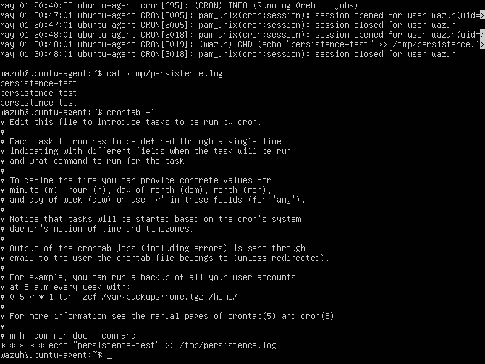
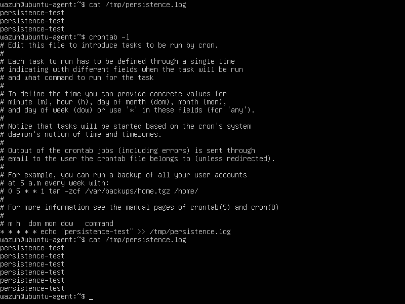
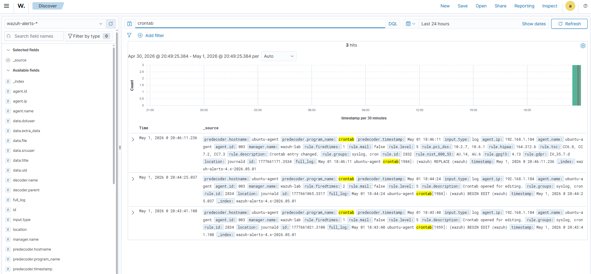

# ⏱️ Wazuh SIEM Lab – Detection of Persistence via Cron Job (Linux)

## 📌 Overview

This project demonstrates detection and analysis of persistence mechanisms on a Linux system using Wazuh SIEM.

The objective was to simulate a scenario where an attacker establishes persistence by scheduling recurring tasks using cron.

---

## 🏗️ Lab Environment

* SIEM: Wazuh Manager (Ubuntu Server)
* Target: Ubuntu Linux (Wazuh Agent)
* Scenario Type: Persistence / Post-exploitation
* Network: Isolated lab (VirtualBox)

---

## 🎯 Attack Scenario

Persistence was established by creating a cron job that executes a command every minute.

### Command used:

```bash id="zhwmbd"
crontab -e
```

Added entry:

```bash id="kebygk"
* * * * * /bin/echo "persistence-test" >> /tmp/persistence.log
```

This ensures continuous execution of a command, simulating attacker-controlled persistence.

---

## 🔍 Evidence of Execution

The persistence mechanism was verified by checking the output file:

```bash id="ls04n4"
cat /tmp/persistence.log
```

Repeated entries confirm scheduled execution.

---

## 🚨 Detection in Wazuh

Wazuh may detect persistence-related activity through:

* Monitoring changes to cron configurations
* File Integrity Monitoring (FIM)
* Detection of scheduled task modifications

---

## 🧠 Analysis

The use of cron jobs is a common persistence technique:

* Executes commands automatically
* Survives user logout
* Can be used to re-establish access or run malicious scripts

This behavior is consistent with attacker techniques used after initial compromise.

---

## 🧠 Analyst Notes

This activity indicates the establishment of a persistence mechanism using scheduled task execution.

While cron jobs are legitimate administrative tools, recurring execution of arbitrary commands—especially writing to unusual locations such as `/tmp`—is suspicious and should be investigated.

No additional malicious payload was observed in this scenario.

---

## 🧬 MITRE ATT&CK

| Tactic      | Technique            | ID    |
| ----------- | -------------------- | ----- |
| Persistence | Scheduled Task / Job | T1053 |

---

## 🛠️ Detection Logic

Detection is based on:

* Monitoring cron job creation/modification
* Observing recurring execution patterns
* Identifying suspicious command usage

---

## 🚨 Severity Assessment

Medium

Escalates if:

* used to execute malicious payloads
* combined with privilege escalation
* used for remote command execution

---

## 🛡️ Recommendations

* Monitor cron job modifications
* Restrict access to cron configuration
* Audit scheduled tasks regularly
* Implement file integrity monitoring
* Investigate unexpected recurring jobs

---

## 📸 Screenshots

Include:





---

## ✅ Outcome

This lab confirms that:

* Persistence mechanisms can be easily established using cron
* Scheduled task monitoring is critical for detecting long-term threats
* Wazuh provides visibility into configuration changes and system activity

---

## 📁 Next Steps

* File Integrity Monitoring (FIM)
* Detection of malicious scripts
* Correlation with privilege escalation events
