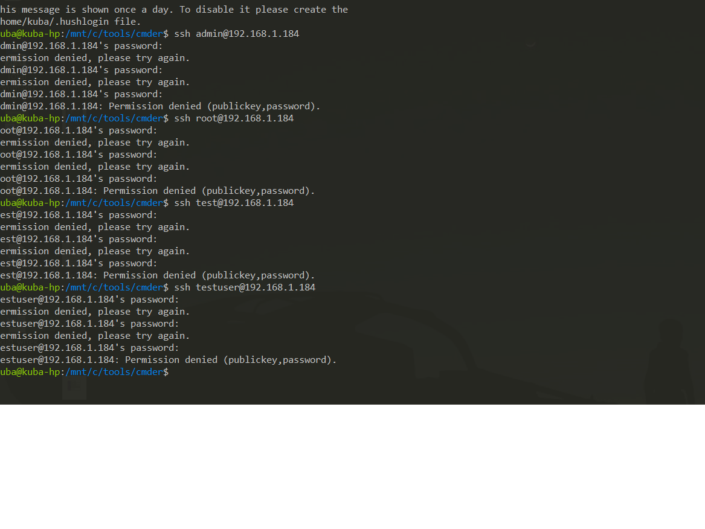
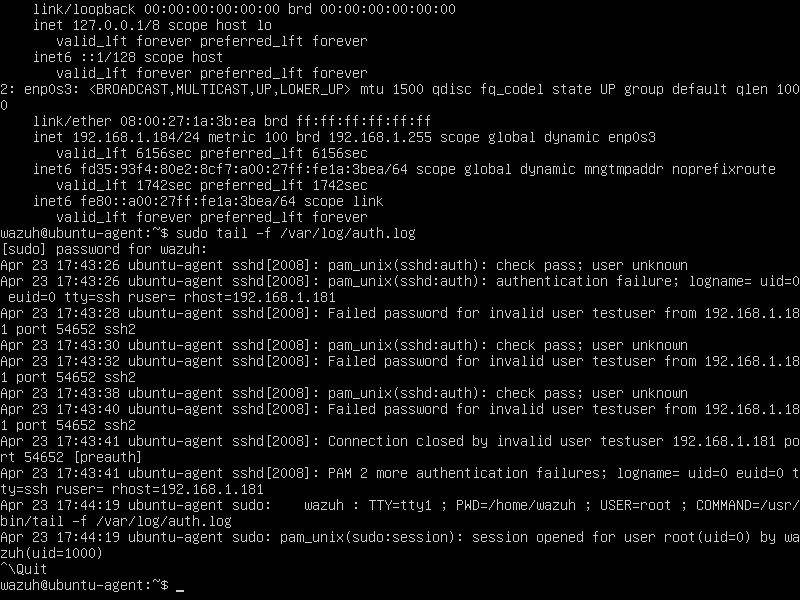
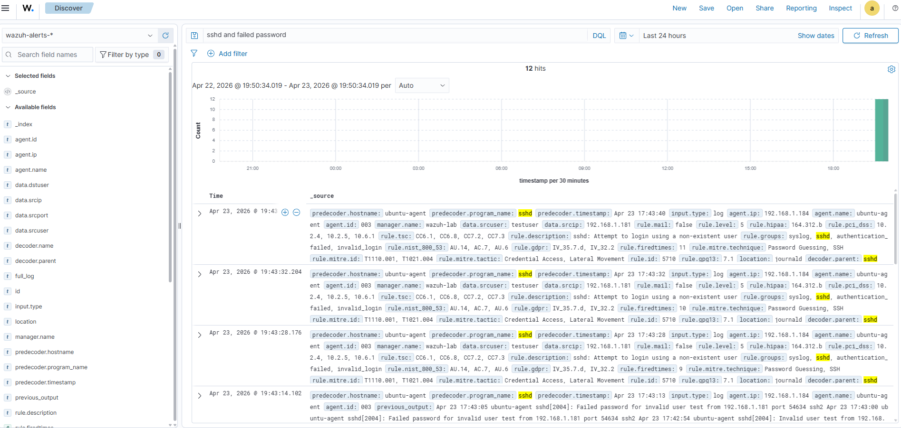

# 🐧 Wazuh SIEM Lab – Detection of SSH Brute Force Attack

## 📌 Overview

This project demonstrates detection and analysis of a simulated SSH brute force attack against a Linux endpoint using a Wazuh SIEM environment.

The objective was to generate authentication failures, observe system logs, and validate detection through Wazuh rules.

---

## 🏗️ Lab Environment

* SIEM: Wazuh Manager (Ubuntu Server)
* Target: Ubuntu Linux (Wazuh Agent)
* Attacker: Separate host within local network
* Network: Isolated lab (VirtualBox)

---

## 🎯 Attack Scenario

A brute force attack was simulated by repeatedly attempting to authenticate over SSH using invalid credentials.

### Attack Execution

From an external host:

```bash
ssh admin@<TARGET_IP>
ssh root@<TARGET_IP>
ssh test@<TARGET_IP>
```

Multiple failed login attempts (10–20) were generated using incorrect passwords.

---

## 🔍 Log Evidence (Linux)

Authentication logs confirmed repeated failures:

```text
Failed password for invalid user admin from <SOURCE_IP>
Failed password for root from <SOURCE_IP>
```

Log location:

```bash
/var/log/auth.log
```

---

## 🚨 Detection in Wazuh

Wazuh successfully detected the activity using built-in SSH rules.

### Alert Details

* Rule Description: SSH login failed
* Log Source: `sshd`
* Agent: Linux endpoint
* Source IP: Attacker machine
* Event Type: Authentication failure

---

## 🧠 Analysis

The observed behavior indicates a brute force attack:

* High number of failed authentication attempts
* Multiple username guesses
* Single originating IP address

Such patterns are commonly associated with automated attack tools attempting credential compromise.

---

## 🧬 MITRE ATT&CK Mapping

* Technique: T1110 – Brute Force
* Tactic: Credential Access

---

## 🚨 Severity Assessment

Medium → High (depending on frequency and success rate)

Escalates if:

* valid credentials are obtained
* attack spreads across multiple systems

---

## 🛠️ Detection Logic

Wazuh correlates:

* SSH daemon logs (`sshd`)
* Authentication failures
* Repeated patterns over time

---

## 🛡️ Recommendations

* Disable password-based SSH authentication
* Enforce SSH key-based access
* Implement rate limiting (e.g., Fail2Ban)
* Monitor repeated failed login attempts
* Restrict SSH access via firewall (IP allowlist)

---

### Attack Simulation


### Log Evidence


### Detection in Wazuh

---

## ✅ Outcome

This lab confirms that:

* Linux authentication logs are correctly collected
* Wazuh detects brute force patterns effectively
* Security monitoring pipeline is functioning as expected

---

## 📁 Next Steps

* Privilege escalation detection (sudo abuse)
* File integrity monitoring (FIM)
* Lateral movement simulation
