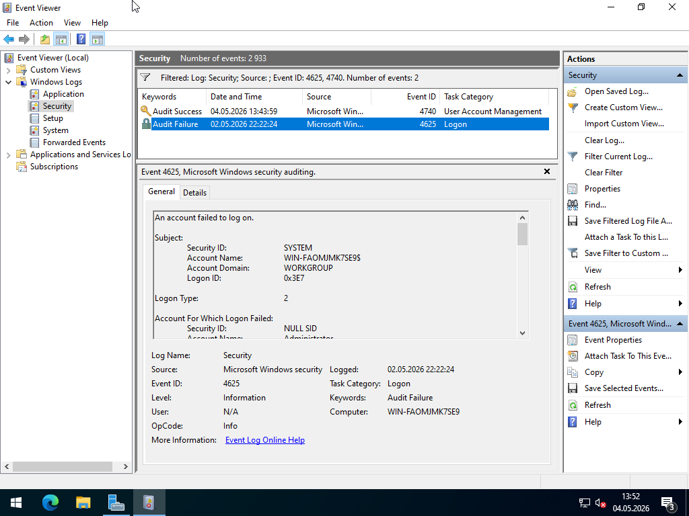
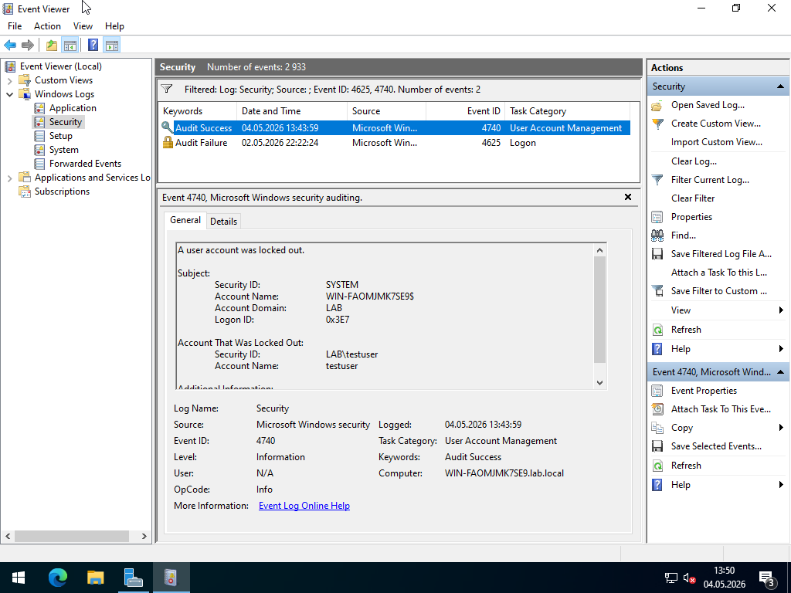
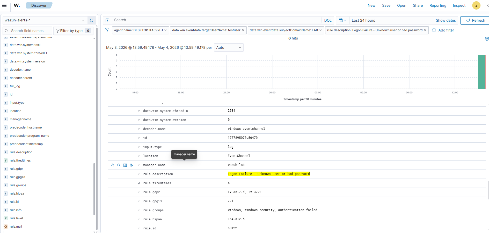
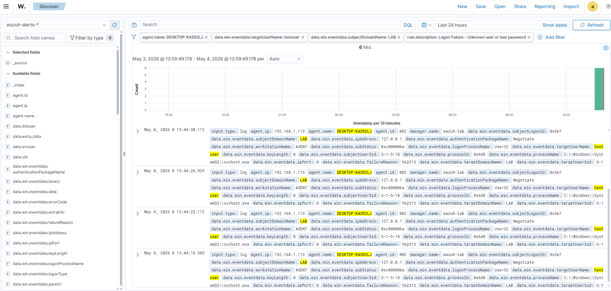

# 🪟 Wazuh SIEM Lab – Active Directory Account Lockout Detection

## 📌 Overview

This project demonstrates detection of account lockout events in an Active Directory environment using a Wazuh SIEM setup.

The objective was to simulate a brute force attack against a domain user account and analyze how the activity is logged and detected.

---

## 🏗️ Lab Environment

* SIEM: Wazuh Manager (Ubuntu Server)
* Domain Controller: Windows Server (Active Directory)
* Endpoint: Windows 10 (domain-joined)
* Domain: `lab.local`
* Scenario Type: Credential Access / Brute Force

---

## 🎯 Attack Scenario

A brute force attack was simulated by repeatedly attempting to log in with incorrect credentials to a domain account.

### Target account:

```text
lab\testuser
```

Multiple failed login attempts triggered an account lockout based on domain policy.

---

## ⚙️ Configuration

Account lockout policy was configured via Group Policy:

* Account lockout threshold: 5 attempts
* Lockout duration: 5 minutes
* Reset counter: 5 minutes

---

## 🔍 Evidence of Attack

### Failed login attempts

```text
Event ID: 4625
Description: An account failed to log on
```

### Account lockout

```text
Event ID: 4740
Description: A user account was locked out
```

These events were observed in the Security log on the Domain Controller.

---

## 🚨 Detection in Wazuh

Wazuh successfully collected and displayed:

* Multiple failed login attempts (4625)
* Account lockout event (4740)

This provides visibility into brute force behavior in an Active Directory environment.

---

## 🧠 Analysis

The sequence of failed logins followed by an account lockout is a strong indicator of:

* Brute force attack
* Password guessing
* Credential-based attack

Such behavior is commonly observed in enterprise environments and should trigger immediate investigation.

---

## 🧠 Analyst Notes

This activity represents a typical brute force attempt against a domain account.

Key observations:

* Repeated authentication failures
* Lockout triggered by policy
* Clear attack pattern over time

This type of activity is often associated with automated attack tools or password spraying campaigns.

---

## 🧬 MITRE ATT&CK

| Tactic            | Technique   | ID    |
| ----------------- | ----------- | ----- |
| Credential Access | Brute Force | T1110 |

---

## 🛠️ Detection Logic

Detection is based on:

* Monitoring Windows Security Events
* Identifying repeated failed logins
* Detecting account lockout events

---

## 🚨 Severity Assessment

Medium → High

Escalates if:

* multiple accounts targeted
* attempts originate from different hosts
* combined with successful login

---

## 🛡️ Recommendations

* Enforce strong password policies
* Monitor repeated login failures
* Alert on account lockouts
* Implement MFA where possible
* Investigate source of login attempts

---

## 📸 Screenshots

Include:

* Event ID 4625 (failed login)
* Event ID 4740 (account lockout)
* Wazuh dashboard showing alerts

 
### Event ID 4625 (failed login)

### Event ID 4740 (account lockout)

### Wazuh dashboard showing alerts



---

## ✅ Outcome

This lab demonstrates that:

* Active Directory logs provide critical visibility into authentication events
* Wazuh effectively detects brute force behavior
* Account lockout policies help mitigate credential attacks

---

## 📁 Related Scenarios

* Windows Failed Logon (local)
* Linux SSH Brute Force
* Multi-stage attack simulation
