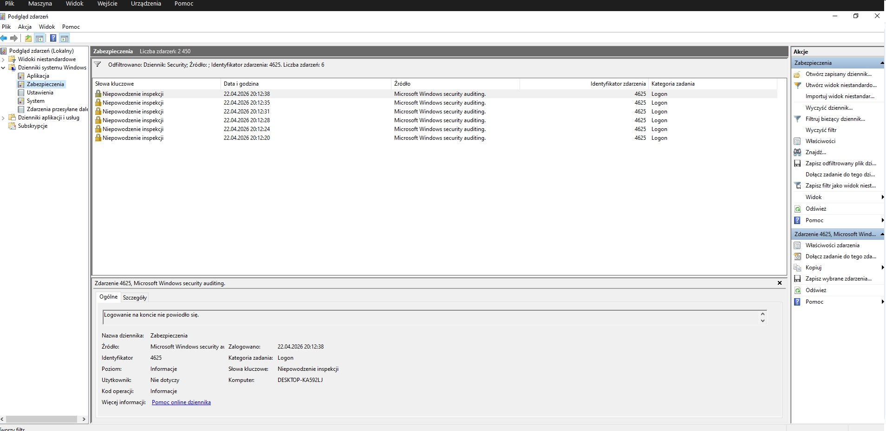
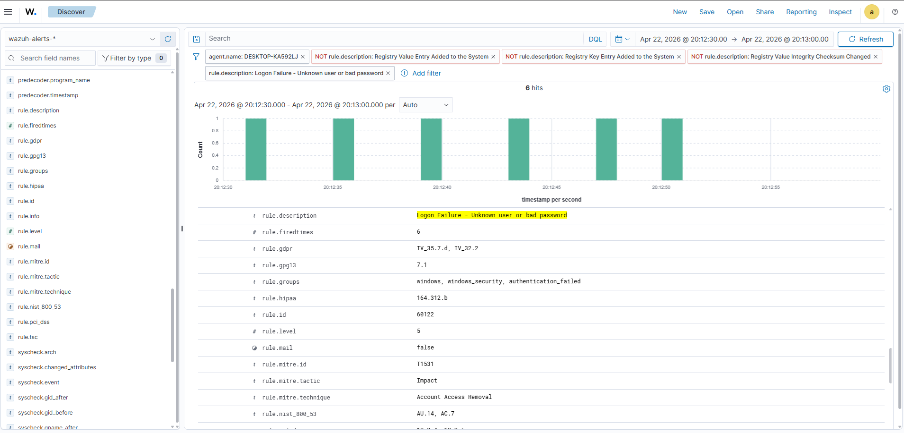

# 🛡️ Wazuh SIEM Lab

This project demonstrates real-world security monitoring scenarios using Wazuh SIEM.

The lab includes simulated attacks and detection techniques commonly observed in Security Operations Centers (SOC).

---

## 🎯 Objectives

- Simulate real-world attack scenarios
- Detect malicious activity using Wazuh
- Analyze security events
- Map detections to MITRE ATT&CK

---

## 📂 Scenarios

- Windows Failed Logon (Event ID 4625)
---

## 🏗️ Lab Environment

* **SIEM**: Wazuh Manager (Ubuntu Server VM)
* **Agent 1**: Windows 10 VM
* **Agent 2**: Ubuntu VM
* **Network**: Internal LAN (VirtualBox)

---

## 🎯 Scenario: Failed Logon Simulation

A simulated attack was performed by generating multiple failed login attempts on a Windows endpoint.

### Steps:

1. Logged out from Windows session
2. Entered incorrect password multiple times (5–10 attempts)
3. Triggered Windows Security Event Log entries

---

## 🔍 Detection

Wazuh successfully detected the activity using built-in rules.

### Key Event:

* **Event ID**: 4625
* **Description**: An account failed to log on

### Wazuh Alert:

* **Rule Description**: Login failure
* **Agent Name**: Windows endpoint
* **Log Source**: Windows Security Log

---

## 🧠 Analysis

Multiple failed login attempts may indicate:

* Brute force attack
* Password spraying
* Unauthorized access attempts

---

## 🧠 Analyst Notes

This activity is consistent with brute force behavior commonly observed in real-world environments.

The repeated authentication failures from a single source indicate an attempt to gain unauthorized access.

No successful login was observed, suggesting the attack was unsuccessful.

---

## 🧬 MITRE ATT&CK Mapping

* **Technique**: T1110 – Brute Force
* **Tactic**: Credential Access

---

## 🚨 Severity

Medium (can escalate if repeated frequently)

---

## 🛠️ Recommendations

* Monitor repeated failed logins
* Implement account lockout policies
* Enable multi-factor authentication (MFA)
* Review logs for suspicious patterns

---

## 📸 Screenshots

### Windows Event Log (4625)

### Wazuh Detection

This confirms that multiple failed login attempts were generated and successfully detected by Wazuh.

---

## ✅ Outcome

This lab confirms that:

* Wazuh correctly ingests Windows logs
* Detection rules are functioning
* SIEM pipeline works end-to-end

---

## 📁 Next Steps

* Simulate SSH brute force (Linux)
* Detect privilege escalation
* Build correlation rules
